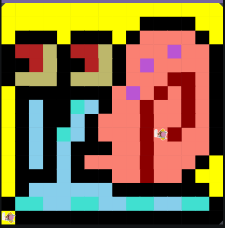

# Unit 1 - Asphalt Art

## Introduction

Cities use asphalt art to improve public safety, inspire their residents and visitors, and brighten communities. Your goal is to create asphalt art to revitalize The Neighborhood and bring the community together with the help of the Painter.

## Requirements

Use your knowledge of object-oriented programming, algorithms, the problem solving process, and decomposition strategies to create asphalt art:
- **Create a new subclass** – Create at least one new subclass of the PainterPlus class that is used for a component of the asphalt art design.
- **Plan an algorithm** – Use the problem solving process and decomposition strategies to plan an algorithm that incorporates a combination of sequencing, selection, and/or iteration.
- **Write a method** – Write at least one method in a PainterPlus subclass that contributes to a component of the asphalt art design.
- **Document your code** – Use comments to explain the purpose of the methods and code segments.

## Notes: Neighborhood & Painter Class

This project was created on Code.org's JavaLab platform using the built in Neightborhood GUI output. To test and edit this project you must build in Code.org's JavaLab with the Neighborhood GUI enabled. For reference to the Painter class documentation, [you can read more here.](https://studio.code.org/docs/ide/javalab/classes/Painter)

## Output:
### Original Sketch
 
### Final Image

## Reflection

1. Describe your project.

   - My project used two classes and many created methods to create a pixel-art image of Gary the snail from Spongebob.

2. What are two things about your project that you are proud of?

   - The first thing I am proud of is the code I wrote to move my painter to different parts of the grid. I did this by only using one method and a parameter that would dictate which part of the snail I would go to to paint. The seconf thing I am proud of is the way I painted the shell. I did this by having many if statements that would change where the painter paints certain colors and where the painter would turn to the next part of the shell.

3. Describe something you would improve or do differently if you had an opportunity to change something about your project.

   - To improve my code I would make it more efficient with different if-statements and while-loops that do small tasks.